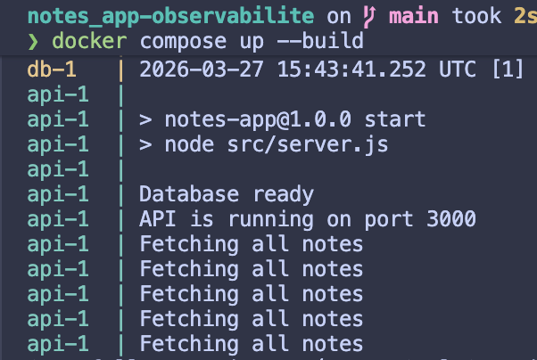

Arnaud Gaydamour - Elias El Oudghiri

# notes_app-CI_CD

## Questions

> Tester en changeant `LOG_LEVEL=warn` dans l’environnement.
* Les logs qui sont en Info ne s'affichent pas, seulement les logs en `warn` et `error` s'affichent.

> À quoi ressemble un log issu de `console.log` ?
* C'est un simple log en texte

> À quoi ressemble un log issu de `logger` ?
* C'est un Json bien structuré, avec les infos : `level`, `time`, `pid`, `hostname`, `msg/port`

> Quelles sont les différences entre les deux ?
* La différence entre les deux est que le simple console.log ne donne aucune info sur le contexte du message, alors que le json, est dans un premier temps un format qui peut être facilement parser, et dans un second temps, il contient le contexted du log, avec le temps, le pid et surtout le hostname.

> Pourquoi ne peut-on pas stocker ces logs dans un fichier de log sur le cloud ?
* Si on stock un fichier de log dans le cloud, lors du redémarrage du container, il y a une perte des logs précédents.

> Quelle différence entre `Counter` et `Histogram` ?
* Un `Counter` sert à compter une valeur qui ne fait qu’augmenter, par exemple le nombre total de requêtes. Un `Histogram`, lui, sert à mesurer la répartition d’une valeur dans des intervalles, par exemple les temps de réponse, ce qui permet de voir combien de requêtes tombent dans chaque tranche de durée.

> À quoi sert `/health/db` comparé à `/health` ?
* `/health` sert à vérifier que l’API est simplement en fonctionnement. `/health/db`, lui, sert à vérifier que l’API peut aussi communiquer avec la base de données. Donc on peut avoir `/health` en OK alors que `/health/db` est en erreur si l’application tourne encore mais que la base est indisponible.
