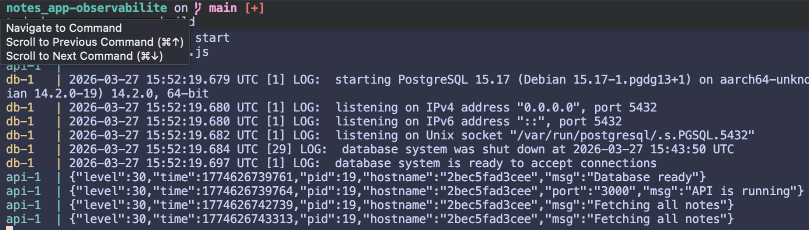

# notes_app-CI_CD

## Questions

> Tester en changeant `LOG_LEVEL=warn` dans l’environnement.
* Les logs qui sont en Info ne s'affichent pas, seulement les logs en `warn` et `error` s'affichent.

> À quoi ressemble un log issu de `console.log` ?
* C'est un simple log en texte

> À quoi ressemble un log issu de `logger` ?
C'est un Json bien structuré, avec les infos : `level`, `time`, `pid`, `hostname`, `msg/port`

> Quelles sont les différences entre les deux ?
La différence entre les deux est que le simple console.log ne donne aucune info sur le contexte du message, alors que le json, est dans un premier temps un format qui peut être facilement parser, et dans un second temps, il contient le contexted du log, avec le temps, le pid et surtout le hostname.

> Pourquoi ne peut-on pas stocker ces logs dans un fichier de log sur le cloud ?
Si on stock un fichier de log dans le cloud, lors du redémarrage du container, il y a une perte des logs précédents.
